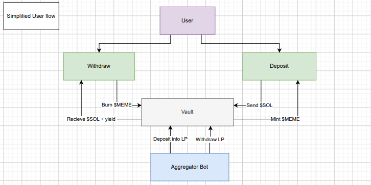
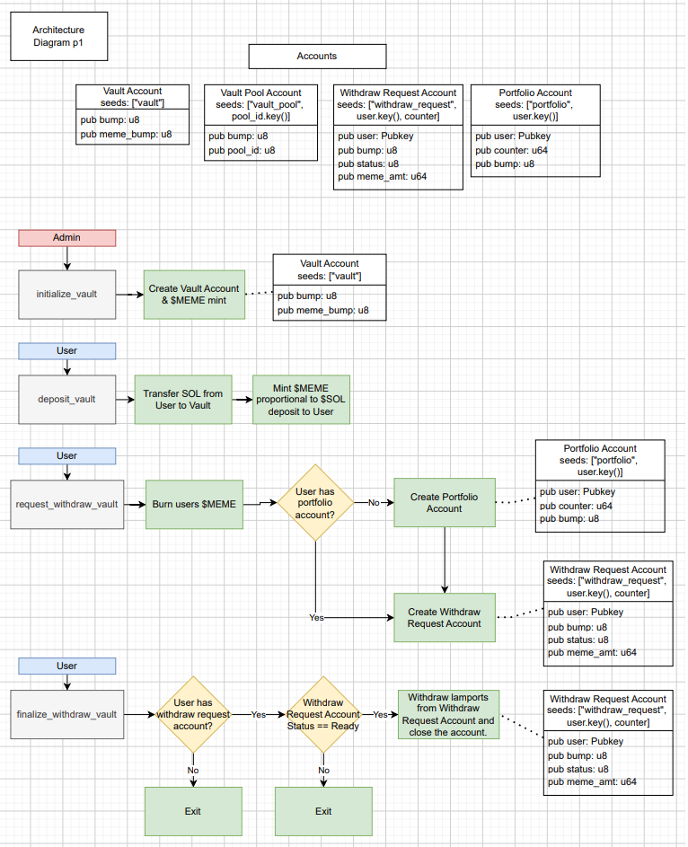
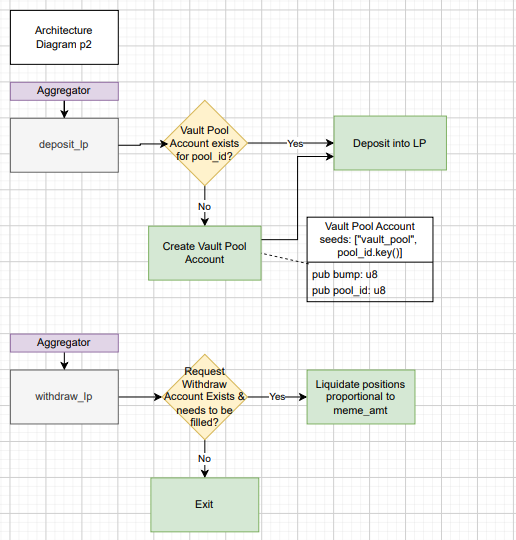

# Memepool

# Project Overview

## Capstone Project Name/Idea:

Memepool - a meme coin yield aggregator on Solana.

## Brief Project Description:

MemePool is a meme coin yield aggregator that allows anyone to get in on the meme coin action. Users can deposit $SOL to get $MEME which represents their stake in the pool. The aggregator will search across different liquidity pools and invest in promising positions.

## Product-Market Fit:
The meme coin market is thriving, but navigating it is often risky and time-consuming, leaving many investors frustrated with scams and rug pulls. Memepool solves this problem by managing meme coin-related liquidity pool positions on your behalf. By simply depositing SOL into the contract, users can effortlessly earn yield without the stress of constant research or active management. 


# Technicals

## Build/Test/Deploy
```build devnet:
build:
anchor build -- --features devnet 

test:
anchor test --skip-build --skip-deploy

deploy:
anchor deploy
```

## Simplified User Flow


## Architecture Diagram (Admin/Users)


## Architecture Diagram (Aggregator)

